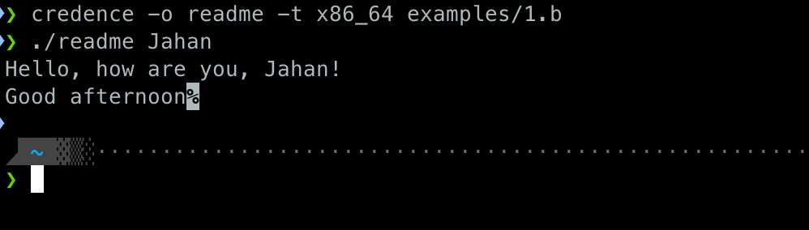
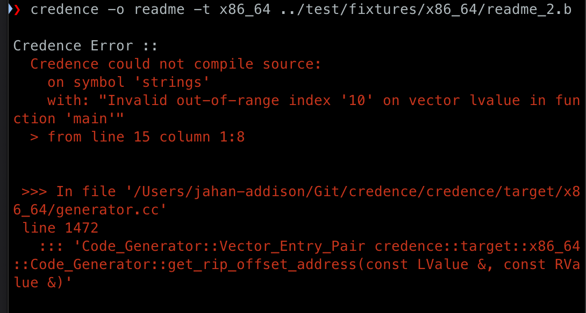

<div align="center">
   </img>
</div>

<br>

> Dual-licensed under Apache License v2 and GPL v3, see details [here](#licensing).

Language grammar: [here](https://github.com/jahan-addison/augur/blob/master/augur/grammar.lark)
<br>
Language reference: [here](https://www.nokia.com/bell-labs/about/dennis-m-ritchie/btut.pdf)


## Overview

The compiler works in 3 stages:

* The Lexer, Parser first-pass built with an [LALR(1) grammar and parser generator](https://github.com/jahan-addison/augur) in python that interfaces with C++ via `pybind11`
* An IR (intermediate representation) I've named [Instruction Tuple Abstraction or ITA](credence/ir/README.md) - a linear 4-tuple set of platform-agnostic instructions that represent program flow, scope, and type checking
* The target platforms and ISAs - x86-64, ARM64 for Linux and BSD, Darwin

<span style="font-size:18px">
Check out the <a href="https://soliloq.uy/tag/credence/">blog series</a>!
<br>
</span>

## Features

These features are not in the original B language specification.

* **Strongly typed by type inference**
* Vectors may be non-homogeneous but their type is determined by their initial values and may not be changed
* Uninitialized variables are set to an internal `null` type
* Compiletime out-of-range boundary checks on vectors and pointer arithmetic
* `goto` and labels are not supported, use control structures
* C style `float` and `double` literal types (e.g. `5.55f`)
* C style constant literals
* C++ style comment support
* `argc` and `argv` support
* Logical and bitwise operators behave like C
* Operator precedence behaves like C
* VSCode extension provided in `ext/`
* Switch statement condition must always be enclosed with `(` and `)`
* Binary operators may not be used directly after the `=` operator

Note that windows is not supported. Please open an issue or pull request for any bugs you may find.

## Targets

See documentation on code generation [here](credence/target/readme.md). A complete assembler and linking tool is installed via the installation script. See [usage details](#usage) below.

> #### x86-64 for Linux and BSD, Darwin : Done ✅

> #### ARM64 for Linux and BSD, Darwin : Done ✅

The generated machine code is compliant with the Application Binary Interface (ABI) for System V, and ARM64 Standard Procedure Call Standard (PCS).


## Installation

Download via `git clone` then run the `bin/install.sh` script with `bash bin/install.sh`

## Test Suite

Credence [line and function code coverage](https://jahan-addison.github.io/credence/) is available with exhaustive type checking, ast, and code generation test suites.

To build the test suite and coverage yourself (with `llvm-cov`), run:

```bash

cmake -Bbuild -DCMAKE_BUILD_TYPE=Debug -DUSE_SANITIZER="Address;Undefined" -DCMAKE_EXPORT_COMPILE_COMMANDS=ON -DIWYU=OFF -DENABLE_TEST_COVERAGE=ON
cmake --build build
cmake --build build --target coverage

```

---

### [The Standard Library](credence/target/common/runtime.h#34)

Credence provides a few useful standard library functions that **do not** depend on libc or an external runtime. The standard library object file is pre-compiled in `stdlib/` for each platform and ISA:

In addition, an interface for kernel syscall tables such as `write(3)` is available for each platform, see details [here](credence/target/common/syscall.h).

---

## Example

```C
main(argc, argv) {
  auto *x;
  extrn strings;
  x = "Hello, how are you, %s!\n";
  // using the provided standard library printf function in stdlib/
  if (argc > 1) {
    printf(identity(identity(identity(x))), argv[1]);
    // stdlib print in stdlib/
    print(strings[0]);
  }
}

identity(*y) {
  return(y);
}

strings [3] "Good afternoon", "Good morning", "Good evening";
```
#### Result (ARM64, Darwin):

Check out additional code generation examples in the [arm64 test suite](/test/arm64/generator.cc#95), and [x86_64 test suite](/test/x86_64/generator.cc#71).

 </img>


```asm

.section	__TEXT,__text,regular,pure_instructions

    .p2align 3

    .global _start

_start:
    stp x29, x30, [sp, #-48]!
    mov x29, sp
    str w0, [sp, #20]
    str x1, [sp, #28]
    ldr x10, [sp, #36]
    adrp x6, ._L_str4__@PAGE
    add x6, x6, ._L_str4__@PAGEOFF
    mov x10, x6
    str x10, [sp, #36]
._L2__main:
    ldr w10, [sp, #20]
    mov w8, w10
    cmp w8, #1
    b.gt ._L4__main
._L3__main:
    b ._L1__main
._L4__main:
    ldr x0, [sp, #36]
    bl identity
    mov x0, x0
    bl identity
    mov x0, x0
    bl identity
    ldr x0, [sp, #36]
    ldr x10, [sp, #28]
    ldr x1, [x10, #8]
    bl _printf
    adrp x6, strings@PAGE
    add x6, x6, strings@PAGEOFF
    ldr x0, [x6]
    mov w1, #14
    bl _print
    b ._L3__main
._L1__main:
    ldp x29, x30, [sp], #48
    mov w0, #0
    mov x16, #1
    svc #0x80


identity:
    stp x29, x30, [sp, #-16]!
    mov x29, sp
    mov x0, x0
    ldp x29, x30, [sp], #16
    ret

.section	__TEXT,__cstring,cstring_literals

._L_str1__:
    .asciz "good afternoon"

._L_str2__:
    .asciz "good evening"

._L_str3__:
    .asciz "good morning"

._L_str4__:
    .asciz "hello, how are you, %s\n"

.section __DATA,__data

.p2align 3

strings:
    .xword ._L_str1__

    .xword ._L_str3__

    .xword ._L_str2__

```

---

Here is an example of compile-time boundary checking, if the `print(strings[0])` line is changed to `print(strings[10])` you get the following error:

 </img>


## Intermediate Representation

*Note*: The default compile target is currently the IR, [ITA](credence/ir/README.md):

### Example:

```C
main() {
  auto *a;
  auto c, i, j;
  extrn unit;
  c = unit;
  a = &c;
  i = 1;
  j = add(c, sub(c, i)) - 2;
  if (c > i) {
    while(j > i) {
      j--;
    }
  }
  c = 0;
}

str(i) {
  extrn mess;
  return(mess[i]);
}

add(x,y) {
  return(x + y);
}

sub(x,y) {
  return(x - y);
}

unit 10;

mess [3] "too bad", "tough luck", "that's the breaks";

```

### Produces:


```asm
__main():
 BeginFunc ;
    LOCL *a;
    LOCL c;
    LOCL i;
    LOCL j;
    GLOBL unit;
    c = unit;
    _t2 = & c;
    a = _t2;
    i = (1:int:4);
    _p1 = c;
    _p3 = c;
    _p4 = i;
    PUSH _p4;
    PUSH _p3;
    CALL sub;
    POP 16;
    _t3 = RET;
    _p2 = _t3;
    PUSH _p2;
    PUSH _p1;
    CALL add;
    POP 16;
    _t4 = RET;
    _t5 = _t4;
    j = (2:int:4) - _t5;
_L6:
    _t9 = c > i;
    IF _t9 GOTO _L8;
_L7:
    c = (0:int:4);
_L1:
    LEAVE;
_L8:
_L10:
_L12:
    _t13 = j > i;
    IF _t13 GOTO _L11;
    GOTO _L7;
_L11:
    j = --j;
    GOTO _L10;
 EndFunc ;


__str(i):
 BeginFunc ;
    GLOBL mess;
    RET mess[i] ;
_L1:
    LEAVE;
 EndFunc ;


__add(x,y):
 BeginFunc ;
    _t2 = x + y;
    RET _t2;
_L1:
    LEAVE;
 EndFunc ;


__sub(x,y):
 BeginFunc ;
    _t2 = x - y;
    RET _t2;
_L1:
    LEAVE;
 EndFunc ;

```

## Usage

```
Credence :: B Language Compiler
Usage:
  Credence [OPTION...] positional parameters

  -a, --ast-loader arg   AST Loader [json, python] (default: python)
  -t, --target arg       Target [ir, syntax, ast, arm64, x86_64] (default:
                         ir)
  -d, --debug            Dump symbol table
  -o, --output arg       Output file (default: stdout)
  -h, --help             Print usage
      --source-code arg  B Source file
```

## Dependencies

**Note: These are installed automatically via CPM and cmake.**

* `augur` - [LALR(1) parser generator and Lexer](https://github.com/jahan-addison/augur)
* `easyjson` - [Lightweight memory safe json library](https://github.com/jahan-addison/easyjson)
* `cxxopts` - Lightweight commandline parser
* `matchit` - Pattern matching
* `fmt` - fast constexpr string formatting
* `pybind11`

## Licensing

This project is dual-licensed under the **Apache License, Version 2.0** and the **GNU General Public License, Version 3.0 (or later)**.

You are free to choose the license that best fits your specific use case. For the full text of each license, please see [LICENSE.Apache-v2](LICENSE.Apache-v2) and [LICENSE-GPL-v3](LICENSE.GPL-v3).
