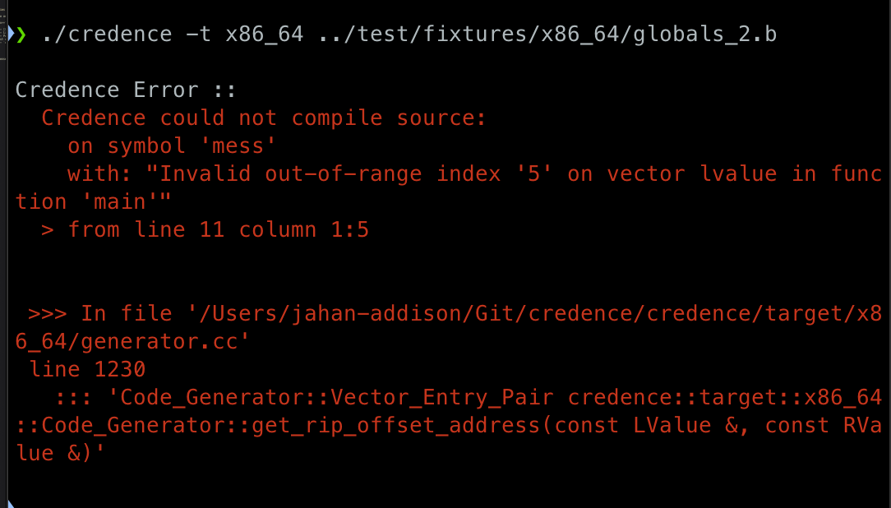

<div align="center">
   </img>
</div>

* B Language grammar - [here](https://github.com/jahan-addison/chakram/blob/master/chakram/grammar.lark)
* Language reference - [here](https://www.nokia.com/bell-labs/about/dennis-m-ritchie/btut.pdf)

---

### Blog series: [Credence](https://soliloq.uy/tag/credence/)

The compiler works in 3 stages:

* The Lexer, Parser first-pass, built with an LALR(1) grammar and parser generator in python that interfaces with C++ via `pybind11`
* An IR (intermediate representation) I've named [Instruction Tuple Abstraction or ITA](credence/ir/README.md) - a linear 4-tuple set of platform-agnostic instructions that represent program flow, scope, and type checking

* The target platforms - x86_64, arm64, and z80 for Linux and BSD (Darwin)

## Features

* **Strongly typed** with type inference, unlike the original B language
  * Vectors (arrays) may be non-homogeneous, but are typed by their initial values at compile-time like a tuple
  * Uninitialized variables are set to an internal `null` type
* Compile-time out-of-range boundary checks on vectors and pointer arithmetic
* Boolean coercion for all data types in conditional structures
* `GOTO` and labels are not supported, use control structures
* Support for C++ style comments
* Logical and bitwise operators behave more like C
* Operator precedence resembles C
* VSCode extension provided in `ext/`
* Switch statement condition must always be enclosed with `(` and `)`
* Binary operators may not be used directly after the `=` operator
* Constant literals must be exactly 1 byte

Note: Currently, windows is not supported.

## Targets

### x86-64:
  * Compliance with the Application Binary Interface (ABI) for System V
  * SIMD memory alignment requirements
### Arm64:
  * In progress
### z80:
  * In progress

## Standard Library

* The standard library object file is pre-compiled in `stdlib/` for each platform

In addition to a small standard library, platform syscall invocation is available, invalid invocation is a compiletime error.

* **Linux** x86_64
  * See details [here](https://github.com/jahan-addison/credence/blob/master/credence/target/x86_64/syscall.h#L58)
* **BSD** (Darwin) x86_64
  * See details [here](https://github.com/jahan-addison/credence/blob/master/credence/target/x86_64/syscall.h#L453)

---

## Usage

```
Credence :: B Language Compiler
Usage:
  Credence [OPTION...] positional parameters

  -a, --ast-loader arg   AST Loader [json, python] (default: python)
  -t, --target arg       Target [ir, syntax, ast, arm64, x86_64, z80]
                         (default: ir)
  -d, --debug            Dump symbol table
  -o, --output arg       Output file (default: stdout)
  -h, --help             Print usage
      --source-code arg  B Source file
```

```bash
./credence --help
```

#### Example

**Note**: access of vector (array) objects is type-safe at compiletime

```C
main() {
  auto x, y;
  extrn unit, mess;
  x = unit;
  y = mess[x];
}

unit 1;

mess [3] "too bad", "tough luck", "that sucks";
```

#### Linux x64:

```asm
.intel_syntax noprefix

.data

._L_str1__:
    .asciz "that sucks"

._L_str2__:
    .asciz "too bad"

._L_str3__:
    .asciz "tough luck"

mess:
    .quad ._L_str2__

    .quad ._L_str3__

    .quad ._L_str1__

unit:
    .long 1

.text
    .global _start

_start:
    push rbp
    mov rbp, rsp
    mov eax, dword ptr [rip + unit]
    mov dword ptr [rbp - 4], eax
    mov rax, qword ptr [rip + mess+8]
    mov qword ptr [rbp - 12], rax
_L1:
    mov rax, 60
    mov rdi, 0
    syscall
```

---

If `unit` is set to `5`, you get the following error:

 </img>


## Intermediate Representation

*Note*: The default compile target is currently the IR, [ITA](credence/ir/README.md):

#### Example:

```C
main() {
  auto *a;
  auto c, i, j;
  extrn unit;
  c = unit;
  a = &c;
  i = 1;
  j = add(c, sub(c, i)) - 2;
  if (c > i) {
    while(j > i) {
      j--;
    }
  }
  c = 0;
}

str(i) {
  extrn mess;
  return(mess[i]);
}

add(x,y) {
  return(x + y);
}

sub(x,y) {
  return(x - y);
}

unit 10;

mess [3] "too bad", "tough luck", "that's the breaks";

```

#### Produces:


```asm
__main():
 BeginFunc ;
    LOCL *a;
    LOCL c;
    LOCL i;
    LOCL j;
    GLOBL unit;
    c = unit;
    _t2 = & c;
    a = _t2;
    i = (1:int:4);
    _p1 = c;
    _p3 = c;
    _p4 = i;
    PUSH _p4;
    PUSH _p3;
    CALL sub;
    POP 16;
    _t3 = RET;
    _p2 = _t3;
    PUSH _p2;
    PUSH _p1;
    CALL add;
    POP 16;
    _t4 = RET;
    _t5 = _t4;
    j = (2:int:4) - _t5;
_L6:
    _t9 = c > i;
    IF _t9 GOTO _L8;
_L7:
    c = (0:int:4);
_L1:
    LEAVE;
_L8:
_L10:
_L12:
    _t13 = j > i;
    IF _t13 GOTO _L11;
    GOTO _L7;
_L11:
    j = --j;
    GOTO _L10;
 EndFunc ;


__str(i):
 BeginFunc ;
    GLOBL mess;
    RET mess[i] ;
_L1:
    LEAVE;
 EndFunc ;


__add(x,y):
 BeginFunc ;
    _t2 = x + y;
    RET _t2;
_L1:
    LEAVE;
 EndFunc ;


__sub(x,y):
 BeginFunc ;
    _t2 = x - y;
    RET _t2;
_L1:
    LEAVE;
 EndFunc ;


```

---

## Test suite

```bash
make test
```

---

## Installation

Note: `$PYTHONHOME` must be set to an installation that has [chakram](https://github.com/jahan-addison/chakram) installed.


### Linux

```bash
sudo apt-get update
# install latest clang
wget -O - https://apt.llvm.org/llvm-snapshot.gpg.key | sudo apt-key add -
sudo add-apt-repository "deb http://apt.llvm.org/$(lsb_release -cs)/ llvm-toolchain-$(lsb_release -cs) main"
sudo apt-get install -y gcc-10 llvm valgrind clang iwyu python3-dev cppcheck clang-tidy pipx
# Inside the repository:
echo 'eval "$(register-python-argcomplete pipx)"' >> ~/.profile
source ~/.profile
cmake -Bbuild -DCMAKE_BUILD_TYPE=Debug -DUSE_SANITIZER="Address;Undefined" -DCMAKE_EXPORT_COMPILE_COMMANDS=ON
cmake --build build
```

### MacOS

```bash
brew update
brew install coreutils include-what-you-use llvm@20 cmake python3 pyenv
# Inside the repository:
cmake .. -DCMAKE_BUILD_TYPE=Debug -DUSE_SANITIZER="Address;Undefined" -DCMAKE_EXPORT_COMPILE_COMMANDS=ON
cmake --build build
```

#### Installing chakram

```bash
git submodule update --init --recursive
cd python/chakram
pipx install poetry # or similar
poetry install
# Be sure to use pyenv or similar
make install
```

---

## Dependencies

**Note: These are installed automatically via CPM and cmake.**

* `simplejson++` - [Lightweight memory safe json library](https://github.com/jahan-addison/simplejson)
* `chakram` - [LALR(1) parser generator and Lexer](https://github.com/jahan-addison/chakram)
* `cxxopts` - Lightweight commandline parser
* `matchit` - Pattern matching
* `fmt` - fast and constexpr string formatting
* `eternal` - constexpr lookup tables
* `pybind11`

# License

Apache 2 License.
