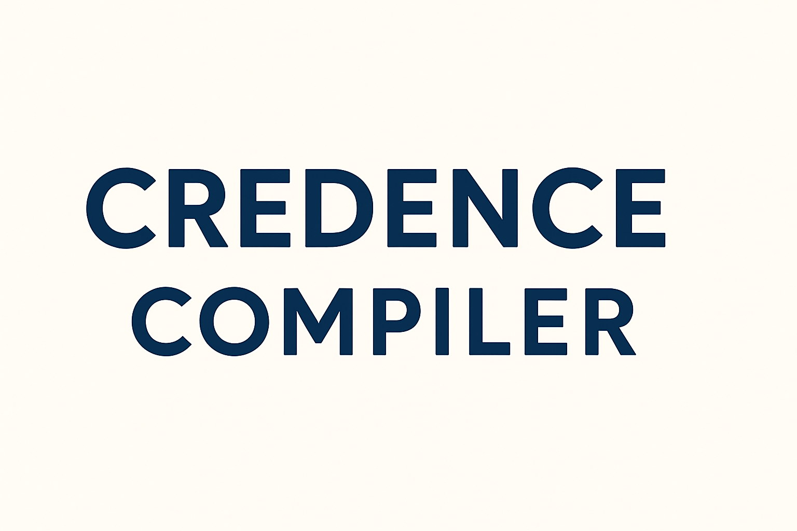

<div align="center">
   </img>
</div>

* B Language grammar - [here](https://github.com/jahan-addison/chakram/blob/master/chakram/grammar.lark)
* Language reference - [here](https://www.nokia.com/bell-labs/about/dennis-m-ritchie/btut.pdf)

---

### Blog series: [Credence](https://soliloq.uy/tag/credence/)

The compiler works in 3 stages:

* The Lexer, Parser first-pass, built with an LALR(1) grammar and parser generator in python that interfaces with C++ via `pybind11`
* An IR I've called [Instruction Tuple Abstraction or ITA](credence/ir/README.md) - a linear 4-tuple set of platform-agnostic instructions that represent program flow, scope, and type checking

* The target platforms - currently x86_64, arm64, and z80

---

There are a few differences between the compiler and B specification, namely:

* Roughly strict typing with type inference
  * Vectors (arrays) may be non-homogeneous
  * The trivial vector is strongly typed
  * Uninitialized variables are set to an internal `null` type
* Compile-time out-of-range boundary checks on vectors and pointer arithmetic
* Boolean "truthy" coercion for all data types in conditionals
* `GOTO` and labels are not supported, use control structures
* Support for C++ style comments
* Logical and bitwise operators behave more like C
* Uses C operator precedence
* Switch statement condition must always be enclosed with `(` and `)`
* Binary operators may not be used directly after the `=` operator
* Constant literals must be exactly 1 byte

## Usage

```
Credence :: B Language Compiler
Usage:
  Credence [OPTION...] positional parameters

  -a, --ast-loader arg   AST Loader [json, python] (default: python)
  -t, --target arg       Target [ir, syntax, ast, arm64, x86_64, z80]
                         (default: ir)
  -d, --debug            Dump symbol table
  -o, --output arg       Output file (default: stdout)
  -h, --help             Print usage
      --source-code arg  B Source file
```

```bash
./credence --help
```

## Targets

The default compile target is currently ITA:

### Example:

B Code:

```C
main() {
  auto *a;
  auto c, i, j;
  extrn unit;
  c = unit;
  a = &c;
  i = 1;
  j = add(c, sub(c, i)) - 2;
  if (c > i) {
    while(j > i) {
      j--;
    }
  }
  c = 0;
}

str(i) {
  extrn mess;
  return(mess[i]);
}

add(x,y) {
  return(x + y);
}

sub(x,y) {
  return(x - y);
}

unit 10;

mess [3] "too bad", "tough luck", "that's the breaks";

```

ITA:


```asm
__main():
 BeginFunc ;
    LOCL *a;
    LOCL c;
    LOCL i;
    LOCL j;
    GLOBL unit;
    c = unit;
    _t2 = & c;
    a = _t2;
    i = (1:int:4);
    _p1 = c;
    _p3 = c;
    _p4 = i;
    PUSH _p4;
    PUSH _p3;
    CALL sub;
    POP 16;
    _t3 = RET;
    _p2 = _t3;
    PUSH _p2;
    PUSH _p1;
    CALL add;
    POP 16;
    _t4 = RET;
    _t5 = _t4;
    j = (2:int:4) - _t5;
_L6:
    _t9 = c > i;
    IF _t9 GOTO _L8;
_L7:
    c = (0:int:4);
_L1:
    LEAVE;
_L8:
_L10:
_L12:
    _t13 = j > i;
    IF _t13 GOTO _L11;
    GOTO _L7;
_L11:
    j = --j;
    GOTO _L10;
 EndFunc ;


__str(i):
 BeginFunc ;
    GLOBL mess;
    RET mess[i] ;
_L1:
    LEAVE;
 EndFunc ;


__add(x,y):
 BeginFunc ;
    _t2 = x + y;
    RET _t2;
_L1:
    LEAVE;
 EndFunc ;


__sub(x,y):
 BeginFunc ;
    _t2 = x - y;
    RET _t2;
_L1:
    LEAVE;
 EndFunc ;


```

---

## Test suite

```bash
make test
```

---

## Installation

Note: `$PYTHONHOME` must be set to an installation that has [chakram](https://github.com/jahan-addison/chakram) installed.


### Ubuntu

```bash
sudo apt-get update
sudo apt-get install -y gcc-10 llvm-20 valgrind clang-20 iwyu python3-dev cppcheck clang-tidy pipx
# Inside the repository:
echo 'eval "$(register-python-argcomplete pipx)"' >> ~/.profile
source ~/.profile
cmake -Bbuild -DCMAKE_BUILD_TYPE=Debug -DUSE_SANITIZER="Address;Undefined" -DCMAKE_EXPORT_COMPILE_COMMANDS=ON
cmake --build build
```

### MacOS

```bash
brew update
brew install coreutils include-what-you-use llvm@20 cmake python3 pyenv
# Inside the repository:
cmake .. -DCMAKE_BUILD_TYPE=Debug -DUSE_SANITIZER="Address;Undefined" -DCMAKE_EXPORT_COMPILE_COMMANDS=ON
cmake --build build
```

### Windows (mingw/msys)

```bash
pacman -S git wget mingw-w64-x86_64-clang mingw-w64-x86_64-gcc mingw-w64-x86_64-ninja mingw-w64-x86_64-cmake make mingw-w64-x86_64-python3 autoconf libtool
# Inside the repository:
# Note: iwyu and the -fsanitizers do not work in mingw
cmake -Bbuild -DCMAKE_BUILD_TYPE=Debug -DCMAKE_EXPORT_COMPILE_COMMANDS=ON
ninja
```

#### Installing chakram

```bash
git submodule update --init --recursive
cd python/chakram
pipx install poetry # or similar
poetry install
# Be sure to use pyenv or similar
make install
```

---

## Dependencies

**Note: These are installed automatically via CPM and cmake.**

* `simplejson++` - [Lightweight memory safe json library](https://github.com/jahan-addison/simplejson)
* `chakram` - [LALR(1) parser generator and Lexer](https://github.com/jahan-addison/chakram)
* `cxxopts` - Lightweight commandline parser
* `matchit` - Pattern matching
* `cpptrace` - Stack traces for runtime errors until C++23
* `eternal` - `constexpr` lookup tables
* `pybind11`

# License

Apache 2 License.
