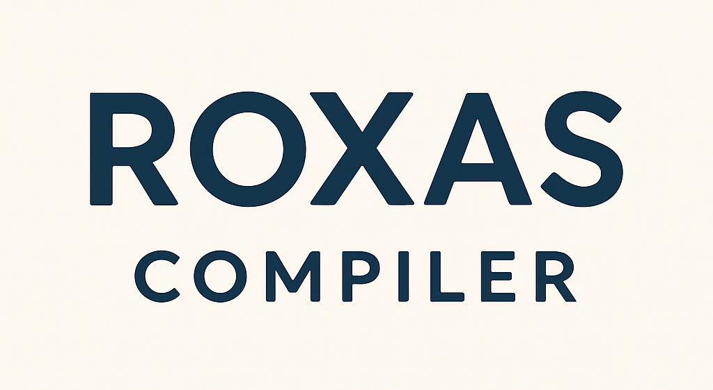

 </img>

> B Language Compiler in C++

* B Language grammar - [here](https://github.com/jahan-addison/xion/blob/master/xion/grammar.lark)
* Language reference - [here](https://www.nokia.com/bell-labs/about/dennis-m-ritchie/btut.pdf)

---


* The frontend (Lexer, Parser) and first-pass is built with an [LALR(1) grammar and parser generator in python](https://github.com/jahan-addison/xion/tree/master), that interfaces with C++ via libpython
* The backend is exploratory research in modern IRs such as SSA, Sea of Nodes, and compiler optimizations through breakthroughs in LLVM, V8, and similar toolchains. The target platforms are x86_64, arm, and z80.

_**status**: in progress_


### Usage

```
Roxas :: Axel... What's this?
Usage:
  Roxas [OPTION...] positional parameters

  -a, --ast-loader arg     AST Loader (json or python) (default: python)
  -d, --debug              Enable debugging
  -h, --help               Print usage
      --source-code arg    B Source file
      --python-module arg  Compiler frontend python module name (default:
                           xion.parser)
      --additional arg     additional arguments for the python loader
```

```bash
./roxas ./my_b_program.b
```

```bash
./roxas --ast-loader=json -d ./my_ast.json
./roxas -h
```

### Installation

#### MacOS

```bash
brew update
brew install coreutils include-what-you-use llvm@18 cmake python3 poetry
git clone git@github.com:jahan-addison/roxas.git
cd roxas
bash ./scripts/install.sh
cd build
cmake .. -DCMAKE_BUILD_TYPE=Debug -DUSE_SANITIZER="Address;Undefined" -DCMAKE_EXPORT_COMPILE_COMMANDS=ON
make
./roxas
```

#### Windows (mingw/msys)

```bash
pacman -S git wget mingw-w64-x86_64-clang mingw-w64-x86_64-gcc mingw-w64-x86_64-ninja mingw-w64-x86_64-cmake make mingw-w64-x86_64-python3 autoconf libtool
git clone git@github.com:jahan-addison/roxas.git
cd roxas
bash ./scripts/install.sh
cd build
# Note: inwyu and sanitizers may not work in mingw
cmake .. -DCMAKE_BUILD_TYPE=Debug -DUSE_SANITIZER="Address;Undefined" -DCMAKE_EXPORT_COMPILE_COMMANDS=ON
ninja
./roxas

```

### Dependencies

**Note: These are installed automatically via CPM and cmake.**

* `SimpleJSON` - Simple JSON parser
* `cxxopts` - Lightweight commandline option parser
* `matchit` - C++17 pattern matching

### Resources

* [Simple and Efficient Construction of Static Single
Assignment Form](https://c9x.me/compile/bib/braun13cc.pdf)
* [Engineering a compiler](https://shop.elsevier.com/books/engineering-a-compiler/cooper/978-0-12-815412-0)

### License

Apache 2 License.


