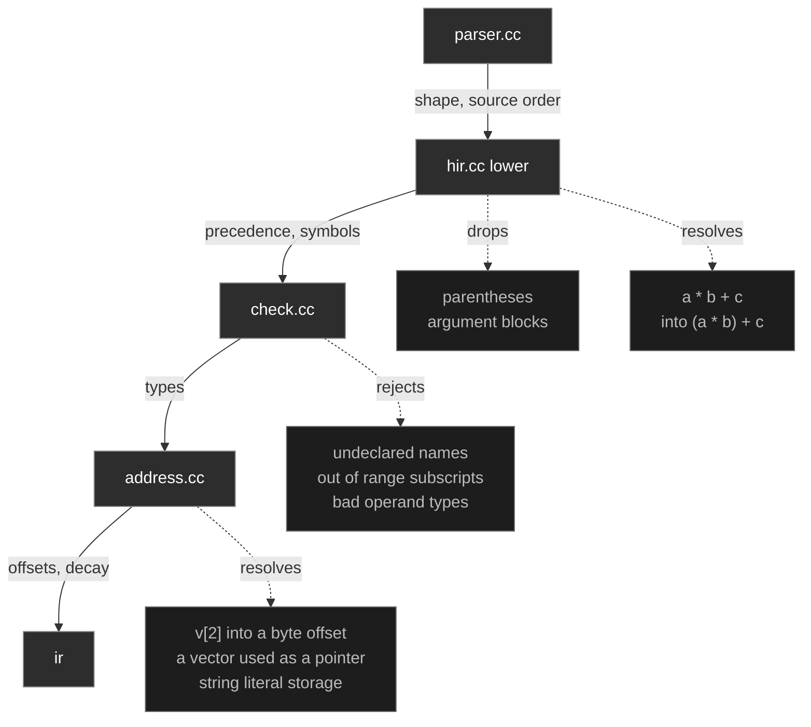

# Frontend

The frontend translates B source code to a type checked HIR that the IR walks into ITA instructions.

Each stage is a separate pass over a flat array. Traversing one is cheap, so the passes stay small and single-purpose instead of doing several jobs in one walk.

```mermaid
flowchart LR
    A[B source] -->|lexer.re| B(Tokens)
    B -->|parser.cc| C(Flat AST)
    C -->|hir/hir.cc| D(HIR)
    D -->|hir/check.cc| E(Typed HIR)
    E -->|hir/address.cc| F(Resolved HIR)
    F -->|ir/hir_queue.cc| G(ITA instructions)

    style A fill:#2d2d2d,stroke:#888,color:#fff
    style B fill:#2d2d2d,stroke:#888,color:#fff
    style C fill:#2d2d2d,stroke:#888,color:#fff
    style D fill:#2d2d2d,stroke:#888,color:#fff
    style E fill:#2d2d2d,stroke:#888,color:#fff
    style F fill:#2d2d2d,stroke:#888,color:#fff
    style G fill:#2d2d2d,stroke:#888,color:#fff
```



Each pass and what it resolves:



## Entry point

[`compile.h`](/credence/frontend/compile.h) runs the whole frontend in one call. It takes source and returns a `Program` with the parsed tree, the lowered unit, and the diagnostics of every pass:

```cpp
auto program = credence::frontend::compile(source);
credence::frontend::report(std::cerr, program);
if (program.failed())
    return 1;
```

Every pass runs before any diagnostic is acted on, so one call reports every error in a program instead of stopping at the first pass to find one. The tree is kept beside the unit for callers that want the program as written and not as lowered, which is what the `ast` target prints.

## Flat AST

[`ast.h`](/credence/frontend/ast.h) is a literal array of structs. A `Node` is a 16 byte POD that owns nothing - no pointer, no `std::string`, and no allocations inside. Everything a node refers to lives in a side arena beside it:

```
nodes        the tree itself, where a child is a Node_Index into this array
metadata     parallel to nodes, the source position of nodes[i]
extra        flattened child lists that a Span indexes into
strings      interned string handles mapped to an offset and length
string_text  the interned character bytes
```

Identifiers and literals are interned, so comparing two names is a `uint32_t` compare and the text is stored once. Across the 31 parser fixtures, 815 identifier and literal occurrences intern down to 815 handles over 3473 bytes of text.

Child lists of any arity go through `extra`, which is why a node with three fields such as a function definition still costs 8 bytes of payload. Children are not adjacent in `nodes`, so a `Span` indexes into `extra` and not into `nodes` directly. In `f(a + b, c * d)` the two arguments sit at indices 8 and 11, with the grandchildren `c` and `d` between them.

### Post-order

Nodes are appended children first, which gives the later passes two properties:

* a subtree is a contiguous range, `first[i]` through `i`, so extracting one is constant time
* a bottom-up pass is a forward loop, as every operand has been visited by the time its parent is reached

## Parser

A hand-written recursive-descent parser over the token stream from a re2c lexer ([`lexer.re`](/credence/frontend/lexer.re)). Every `parse_` entry point returns a `Node_Index` and not a node by value, so no node is copied.

The parser does **not** resolve precedence. A chain such as `a * b + c` is emitted in source order as a right leaning spine, `Binary(*, a, Binary(+, b, c))`, which records the operators correctly but groups them wrongly. Lowering handles that instead, which keeps the parser a pure syntax pass and puts precedence in one place.

### Corners of the grammar

Three rules in the grammar are unintuitive:

* A label with whitespace before its `:` (`loop :`) keeps that whitespace as part of its name. A label is one token, and only the trailing `:` is sliced off.
* A char literal that is exactly one whitespace character (`' '`) keeps its quotes. Every other char literal strips them.
* Consecutive expression statements (`x = 1; y = 2;`) merge into one statement and do not become two, because a statement holds `expression+` and not exactly one.

## HIR

[`hir/`](/credence/frontend/hir/) is the AST after precedence is resolved, names are bound, and syntax that has no meaning is dropped. It keeps the same flat shape, with parallel arrays for types, source positions, and subtree starts.

Three things change as the AST is lowered:

* a chain is reshaped to respect precedence
* an identifier becomes a `Symbol_Index`, resolved once
* parentheses and the blocks holding call arguments are dropped, as neither survives precedence resolution

The HIR vocabulary is smaller than the AST's.

### Lowering

[`hir/hir.cc`](/credence/frontend/hir/hir.cc) walks the right hand spine of a chain back into the flat sequence of operands and operators:

```
operands   a  b  c
operators     *  +
```

and runs shunting-yard over it against the precedence table, so the grouping comes from the operators and not from the order the parser reduced in. Parentheses stop the spine, because the parser leaves an `Evaluated_Expression` between the two halves, which is how `a * (b + c)` keeps its grouping.

### Types

[`hir/type.h`](/credence/frontend/hir/type.h) is a type table, and the type of a node is a `Type_Index` into it and not a string. Two types are the same when their handles are equal, so a comparison is a `uint32_t` compare and each distinct type is stored once. A type holds the size the backend needs, so the `(value : type : size)` tuple the IR prints is recovered from the handle alone.

### Symbols

[`hir/symbol.h`](/credence/frontend/hir/symbol.h) is one flat symbol array with a stack of scope boundaries over it. Closing a scope drops only the boundary, so a `Symbol_Index` resolved while the scope was open still names the same declaration afterwards.

### Checking

[`hir/check.cc`](/credence/frontend/hir/check.cc) is a forward loop and not a walk - post-order means every operand already has a type when its parent is reached. It writes into the types array and reports what a declaration does not allow: arithmetic on a type that cannot take part in it, a subscript on something that is not a vector or a pointer, a constant subscript outside a declared vector, a `goto` naming a label no statement defines, and so on. It never stops at the first error.

### Addresses

[`hir/address.cc`](/credence/frontend/hir/address.cc) resolves what an expression addresses, It handles three cases:

* a vector used as a value decays to a pointer to its first element
* a subscript with a constant index is folded to a byte offset
* every string literal is collected, as one needs storage before its address can be taken

Decay is a property of a use and not of a declaration, so the symbol keeps its vector type and only the use is retyped:

```
declaration "v" [vector] : word[4]     the declaration
  symbol_ref "v" [vector] : word*      "p = v", decayed
  subscript : word
    symbol_ref "v" [vector] : word[4]  a subscript base, not decayed
```

A vector is not decayed where it is the base of a subscript or the operand of an address-of, as both of those want the vector itself. Nothing is inserted into the node array, so an index resolved by an earlier pass stays valid.

The byte offset comes from the element width in the type table, so `v[2]` on a word vector is computed once, here.

## What the IR receives

A subtree in post-order with precedence already resolved is the order an operand stack consumes, so [`ir/hir_queue.cc`](/credence/ir/hir_queue.cc) reads the range `first[i]` through `i` and finds its operands in the order it pops them.

Beside the nodes it reads the parallel arrays: the type of each node, the byte offset of each constant subscript, and the string literals that need storage.

For `x = a * b + c`:

```
symbol_ref:x symbol_ref:a symbol_ref:b binary(*) symbol_ref:c binary(+) assign(=)
```

which is `x a b * c + =`, the reverse polish form a stack machine consumes.

## Tools

```sh
./build/credence -t ast program.b      # the flat AST
./build/credence -t ast -v program.b   # with node indices and positions
./build/credence -t hir program.b      # lowered and checked, with types
./build/credence -t hir -v program.b   # with node indices
./build/credence -t hir -l program.b   # the linear form the IR reads
```

Both targets write to `program.bast` and `program.bhir`, or to stdout with `-o stdout`. Add `-s` to print the hoisted symbol table alongside the dump.

The parser tests compare against golden dumps in `test/fixtures/language/expected`. Regenerate them through the same dump the tests use:

```sh
CREDENCE_BLESS=1 ./build/Test_Suite
```

## Example

```C
add(a, b) {
  return(a + b);
}
```

```
function : null
  declaration "add" [function] : word()
  declaration "a" [parameter] : word
  declaration "b" [parameter] : word
  block : null
    return : null
      binary "+" : word
        symbol_ref "a" [parameter] : word
        symbol_ref "b" [parameter] : word
```
