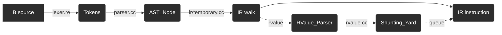

# Language Frontend

Initially, the source-to-AST step was an entirely separate, older Python project, [augur](https://github.com/jahan-addison/augur). It was built on [Lark](https://github.com/lark-parser/lark) and embedded into credence at runtime via pybind11. This folder is a native C++ replacement for that: a re2c-generated lexer and a hand-written recursive-descent parser that produces the exact same JSON AST shape as augur's [`transformer.py`](https://github.com/jahan-addison/augur/blob/master/augur/transformer.py). So that the rest of the frontend did not need to change.

The lexer, datatype, rvalue parser, and shunting-yard pieces are comparatively straightforward once you understand the parser's constraints. Here are the passes:



`RValue_Parser` and the `Shunting_Yard` virtual stack machine only ever see rvalue expressions. The IR (`ir/temporary.cc`) is what walks the full `AST_Node` tree, statement by statement. When it reaches one holding an expression (such as `rvalue_statement`, a `return`, an `if` condition, etc), it hands that subtree to `RValue_Parser` then `Shunting_Yard` and gets a queue back. Everything else such as `auto`, function statements, and so on the IR takes care of on its own.


In hindsight, the RValue <-> Shunting_Yard pair is a replacement for Pratt Parsing.


## Lexer

A lexer built with the lexer-generator re2c from [`lexer.re`](/credence/language/lexer.re) into `lexer.cc` (see `Token`, `Token_Type` in [`lexer.h`](/credence/language/lexer.h)).

## Parser

The original `grammar.lark` is a flat LALR(1) grammar with no real operator precedence at the parse-tree level. Lark's default parser resolves every `rvalue OP rvalue` the same way no matter which operator is involved, so the resulting tree is always right-associative:

```C
main() { auto x, a, b, c; x = a * b + c; }
```

parses as `a * (b + c)`, not `(a * b) + c` - the `*` ends up as the *outer* node simply because it was seen first, not because it binds tighter than `+`.

`Shunting_Yard` in [`shunting_yard.h`](/credence/language/shunting_yard.h) corrects this. A mis-nested chain like the one above always encodes its operators in true left-to-right source order down the tree's right-side - `Mul(a, Add(b, c))` is really the flat sequence `a, *, b, +, c` with the wrong grouping.

`Shunting_Yard` flattens that back into its flat form and runs shunting-yard over it against the real precedence table in [`operators.h`](/credence/language/operators.h), rather than trying to balance precedence against whatever nesting the parser happened to produce. So the parser in `parser.cc` is able to reproduce the original grammar's flat, right-associative structure.

### The ternary

A ternary immediately following a binary operator binds *tighter* than that operator, nesting inside its right operand instead of wrapping it.

```C
main() { auto x; x = 5 < 4 ? 10 : 1; }
```

```json
{
  "node": "relation_expression",
  "root": ["<"],
  "left": { "node": "integer_literal", "root": 5 },
  "right": {
    "node": "ternary_expression",
    "root": { "node": "integer_literal", "root": 4 },
    "left": { "node": "integer_literal", "root": 10 },
    "right": { "node": "integer_literal", "root": 1 }
  }
}
```

Semantically this is `(5 < 4) ? 10 : 1`, but structurally the `4` that completes the `<` comparison ends up as the ternary node's `root`, not as the relation's own `right` operand. This isn't a design choice - it's what a 1-token-lookahead parser does when it sees `?` before it's reduced. `<`. [`rvalue.h`](/credence/language/rvalue.h)'s `from_relation_expression_node` already has a branch that unwinds exactly this shape back into `(condition) ? then : else`.

### Other Weirdness

* A label with whitespace before its `:` (`loop :`) keeps that whitespace as part of its name. The original grammar lexed a label as a single regex token (`NAME [\s]* ":"`) and built its name by slicing off only the trailing `:`, so whatever whitespace preceded it survives.
* A char literal that is exactly one whitespace character (`' '`) keeps its surrounding quotes in `root`; every other char literal strips them. The original grammar had a second, redundant-looking rule matching a quoted space that never went through the same quote-stripping path as the general case.
* Consecutive expression-statements (`x = 1; y = 2;`) merge into a single `rvalue_statement` node rather than two separate statements, because `expression+` is embedded inside the `rvalue_statement` rule itself, not at the statement-list level above it.

## Datatype

[`datatype.h`](/credence/language/datatype.h) is the internal `(Value : Type : Size)` tuple that the compiler uses beyond the AST, and facilitates the type system:

```
(10:int:4)
("hello":string:5)
(55.5:float:4)
('c':char:1)
```

`Datatype::Type` is the algebraic sum of every expression shape the rest of the compiler cares about: `Literal`, `Array`, `Symbol`, `Unary`, `Relation`, `Function`, `LValue`.

## RValue Parser

[`rvalue.h`](/credence/language/rvalue.h)'s `RValue_Parser` walks an expression `AST_Node` built by `parser.cc` into a `Datatype` tree - the second pass over that expression, after the parser's own tree pass. It checks symbol and value category correctness against storage devices, such as that all lvalues were declared with `auto` or `extrn`.

## Shunting Yard

[`shunting_yard.h`](/credence/language/shunting_yard.h) is where operator precedence is actually fixed. It's an extension of the shunting-yard algorithm - **a stack-based virtual machine** - that takes the resolved `Datatype::Expression` tree and re-linearizes it into a queue ordered by the real precedence table in `operators.h`, extended to also handle function calls and their parameters. This is the step that makes the parser's flat, unordered tree above fixed: by the time code generation sees an expression, it's already in the right order, regardless of how the parse tree happened to nest it.

## Example

```C
add(a, b) {
  return(a + b);
}
```

```json
{
  "node": "program",
  "root": "definitions",
  "left": [
    {
      "node": "function_definition",
      "root": "add",
      "left": [
        { "node": "lvalue", "root": "a" },
        { "node": "lvalue", "root": "b" }
      ],
      "right": {
        "node": "statement",
        "root": "block",
        "left": [
          {
            "node": "statement",
            "root": "return",
            "left": [
              {
                "node": "relation_expression",
                "root": ["+"],
                "left": { "node": "lvalue", "root": "a" },
                "right": { "node": "lvalue", "root": "b" }
              }
            ]
          }
        ]
      }
    }
  ]
}
```
