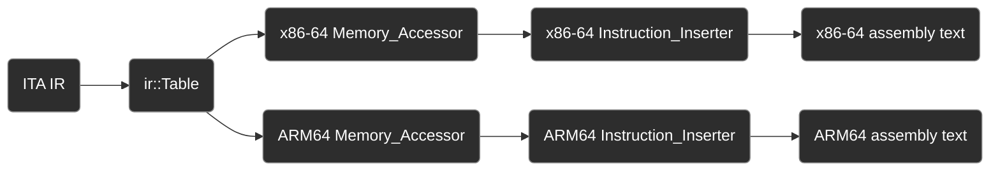

# Overview

Each platform roughly inherits the same set of pure virtual classes, macros, and templates below to `visit` each IR instruction and construct machine code for X8664, ARM64, on Linux and BSD (Darwin).

The `ir::Table` is the last target-agnostic step - it's built once from the ITA, then each platform's `emit()` (see `generator.cc` for x86-64 and ARM64) takes over:

The `Memory_Accessor` and `Instruction_Inserter` template instantiation is where platform-dependent memory mapping and mnemonic generation begin to take place. Afterward the engineering is more easily understood from the code itself than described here.

Check out the test suites in `test/x86_64/generator.cc` and `test/arm64/generator.cc` to see what the machine code looks like for each platform.

## Accessor
#### A set of pure virtual and template classes that enable platform-dependent memory access
## Inserter
#### Deconstruction of algebraic types like unary, relational, bitwise operands to compose machine code of expressions
## Visitor
#### Pure virtual [IR instruction](/credence/ir/README.md) visitor base for each platform
## Assembly
#### Raw ISA mnemonics types, registers, operand storage helpers with string overloading
## Memory
#### Dynamic `Memory_Accessor` pointer that mediates available memory, stack, and registers and their runtime storage via the accessors.
## Stack
#### A push-down stack that corresponds to the platform stack pointer with memory-safe offset resolution
## Flags
#### Instruction flags, such as enforcing a word size or an address mode
## Syscall
#### Platform dependent kernel `syscall` codes, which in Linux's case is different for ARM64 and X8664
## Runtime
#### Standard library and syscall function invocation, operand type checkers

